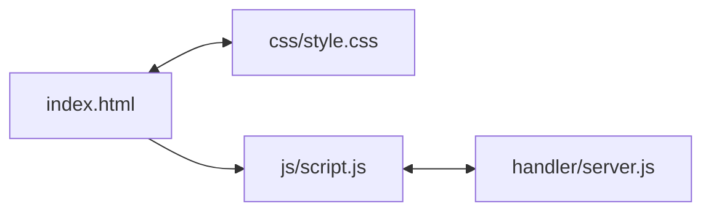

# Introdução

O projeto consiste em uma API criada em Node.js e um FrontEnd Básico com um Formulário para realizar os testes 
das operações `GET`, `POST`, `PUT` e `DELETE`.

O projeto possui a abstração de cadastro de clientes, onde é possível cadastra-los com os atributos `NOME`, `EMAIL` e `IDADE`, e realizar a Consulta, Atualização e Remoção apartir do `ID` do cliente.

## Procedimento para Executar
### 1. Versão do Node.js

Verifique a versão do Node.js
```
node --version
```

Realize a instalação da versão e o uso da versão do Node.js, se necessário com `nvm` (ou baixe a versão):
```
nvm install 23.0
nvm use 23.0
```

### 2. Dependências

Instale as dependências com o gerenciador de dependêcias padrão do Node `npm`:
```
npm install
```
Esse comando irá funcionar apenas se houver os arquivos `package.json` e o `package-lock.json` na raiz do projeto

### 3. Executando a API

Realize a execução da `API` utilzando o comando do `node`:

```
node handlers\server.js
```

Ao receber a mensagem de `Servidor rodando na porta 3000 !` você já tem disponível sua `API` localmente, e você pode acessar no navegador ou no `postman` pela URI: `http:\\localhost:3000`


### 4. Front-End

Abra o arquivo [index.html](index.html) para realizar o uso da interface de usuário no `Navegador WEB`

## Estrutura do Projeto

Estrutura de pastas
```
/api-teste-node.js
├── assets
│   ├── app.js
│   ├── index.js
├── database
│   └── dados.json
├── css
│   └── style.css
├── handlers
│   └── script.js
├── js
│   └── script.js
├── .gitignore
├── package-lock.json
├── package.json
└── index.html

```

### Mapeamento Arquivos
* [assets](assets) possui os arquivos de testes de scripts que estou testando na linguagem;
* [database](database) possui um teste para implementar o armazenamento dos dados no arquivo json [dados](database/dados.json);
* [css](css) contém o arquivo [style.css](css/style.css) com CSS básico do formulário;
* [handlers](handlers/server.js) é a api em `Node.js` com os endpoints `GET`, `POST`, `PUT` e `DELETE` de clientes;
* [js](js/script.js) faz a interação entre a `API` e `FrontEnd` contruido;
* [index.html](index.html) Arquivo principal em `HTML` da página, ele fará a importação dos arquivos anteriores de frontend;
* Arquivos [package.json](package.json) e [package-lock.json](package-lock.json) são os arquivos que carregam as relação de dependências do projeto que o Node.js necessita para criar a pasta `node_modules`


### Fluxograma do projeto



## Desenvolvimento do Projeto: 

- [x] Formulário para GET 
- [x] Formulário para POST
- [x] Formulário para PUT
- [x] Formulário para DELETE   
- [x] Criar um CSS para estruturar o Formulário
- [x] Criado JavaScript para Leitura da API
- [x] Desenvolver API com Node.js
- [x] Desenvolver API com endpoint GET
- [x] Desenvolver API com endpoint POST
- [x] Desenvolver API com endpoint PUT
- [x] Desenvolver API com endpoint DELETE


